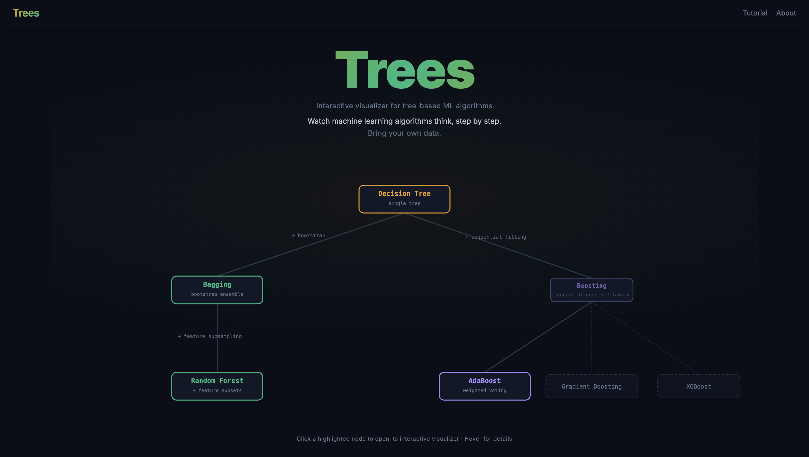
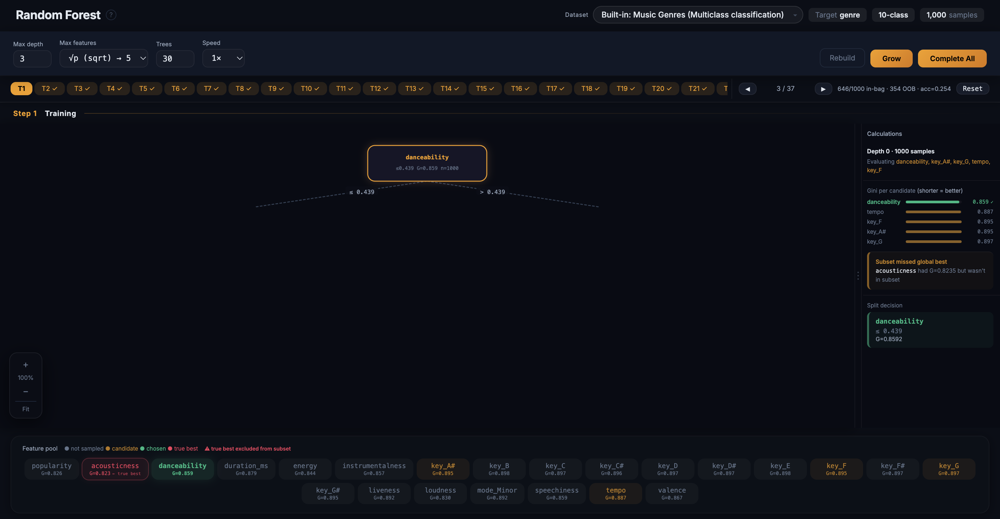
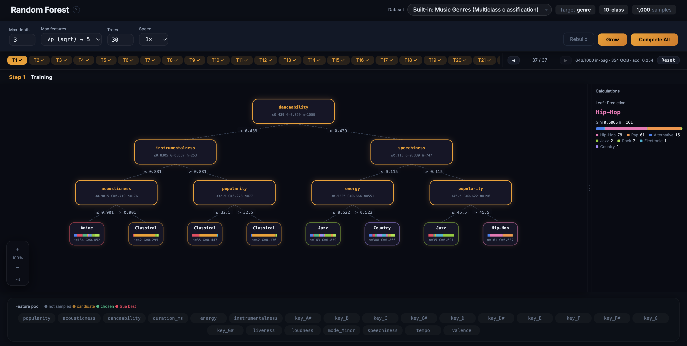
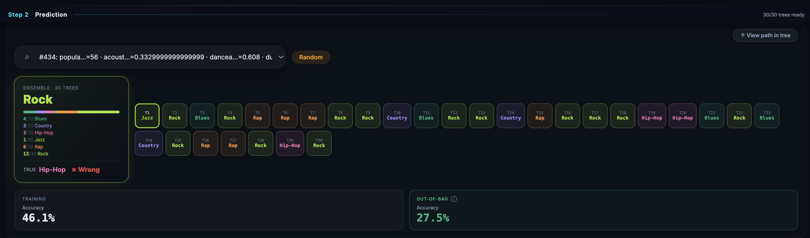
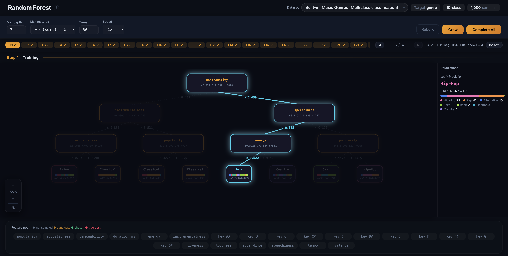
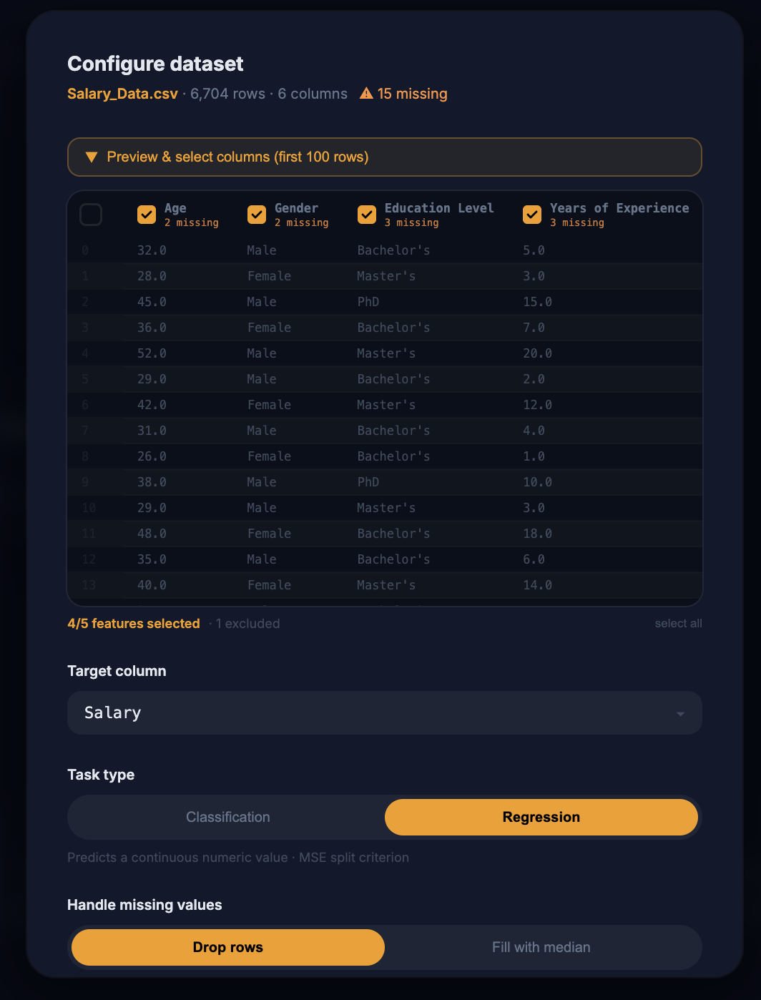

# Trees

Interactive visualizer for tree-based ML algorithms. Watch machine learning algorithms think, step by step.

🌐 [Live Demo](https://trees-hamza.vercel.app/)

---

## The Algorithms

Trees covers Decision Trees, Bagging, Random Forest, and AdaBoost — each visualized from first split to final prediction. Pick an algorithm from the menu to start exploring.



---

## Watch Trees Grow

Step through tree construction one split at a time, with Gini impurity scores shown for every candidate feature at each node. The feature pool highlights which features were sampled in the random subset, and marks whether the chosen split was the true global best or a random-subset compromise.

<p align="center">
  
  <br/>
  <sub><i>Single split — feature pool, Gini per candidate, chosen split</i></sub>
</p>

<p align="center">
  
  <br/>
  <sub><i>Full tree — complete tree grown to max depth</i></sub>
</p>

---

## Ensemble Predictions

Once the forest is built, pick any sample from the dataset and watch all trees cast their votes. The ensemble's final prediction is shown alongside the true label, and you can trace the exact decision path any individual tree took to reach its leaf.

<p align="center">
  
  <br/>
  <sub><i>Ensemble vote — all trees weigh in on one sample</i></sub>
</p>

<p align="center">
  
  <br/>
  <sub><i>Decision path — trace one tree's journey to its prediction</i></sub>
</p>

---

## Bring Your Own Data

Trees isn't limited to the built-in datasets — upload any CSV and the visualizer adapts instantly. It auto-detects columns, lets you choose the target variable, select classification or regression, and configure how missing values are handled.

<p align="center">
  
</p>

---

## Built With

- React 19 + Vite 8
- Web Workers for non-blocking tree construction
- Custom CART implementation (Gini impurity, bootstrap sampling, OOB accuracy)
- React Router v7 for multi-algorithm navigation
- All styling inline — no CSS files or UI libraries

---

## Running Locally

```bash
git clone https://github.com/YOUR_USERNAME/trees.git
cd trees
npm install
npm run dev
```
